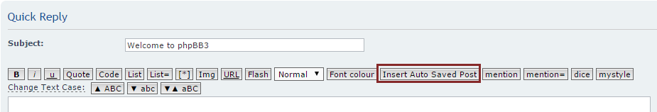

Date of creation: Jul 14, 2015. Last update: Jul 15, 2015.

I once put all of my phpBB extensions into one GitHub respository when I was a GitHub newbie. I am re-committing them for separate repositories.

# What is this?

A phpBB extension will auto-save people's editing posts every certain time invertal. No database involved.

Based on the works of [4_seven](https://www.phpbb.com/community/viewtopic.php?f=434&t=2099750) and [andris9](https://github.com/andris9/jStorage).

Tested on phpBB 3.1.9.

# How to use?

The default time interval is 5 seconds, it means that every 5 seconds, the editing posts / pms will be auto-saved once. You type your words in forum editor then every 5 seconds, your post will be saved into HTML5 local storage of the browser. If you click on Insert Auto Saved Post / Insert Auto Saved PM then you will retrieve your post at the time 5 seconds before.

It does not work when the browser does not support data caching: No error or warning occurs, it is just that the data is not saved.

Remeber that, if you seriously want to retrive your post by clicking on Insert Auto Saved Post / Insert Auto Saved PM, **DO IT QUICKLY IN 5 SECONDS**. Or else, your post will be lost due to the auto-save mechanism.

# Some modifications to extension you may want to do

You can edit the saving time interval in the line 23 of [ext_quickreply_editor_buttons_custom_tags_before.html](styles/prosilver/template/event/ext_quickreply_editor_buttons_custom_tags_before.html#L23) and [posting_editor_buttons_custom_tags_before.html](styles/prosilver/template/event/posting_editor_buttons_custom_tags_before.html#L23). You will find:

`}, 5000);`

5000 here is 5s, it means that every 5 seconds the post is being saved once. You can change it into any number you want.

I am pretty sure that it will work with [QuickReply extension](https://www.phpbb.com/community/viewtopic.php?f=456&t=2259196) but not the default one.

